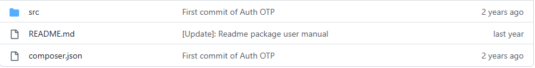
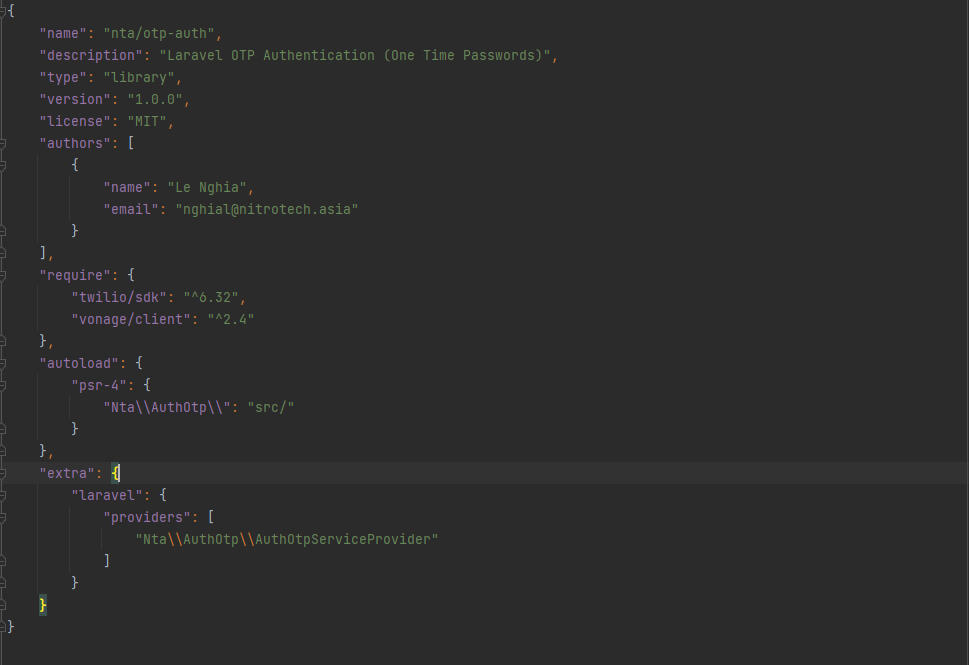
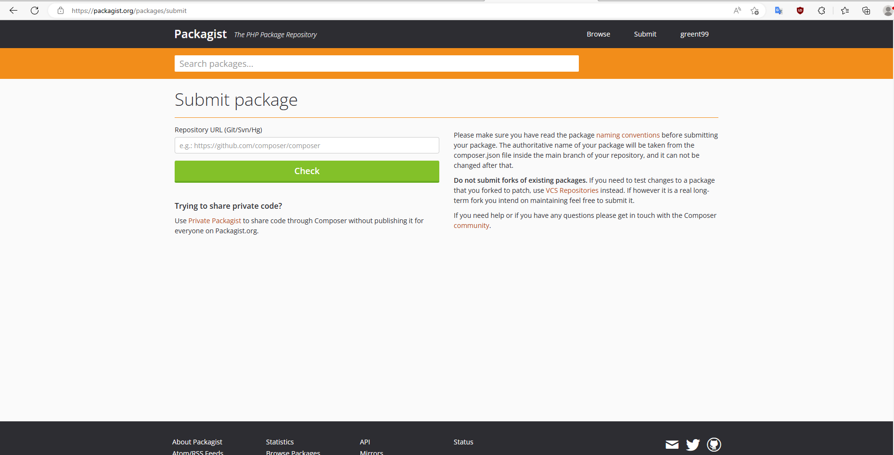
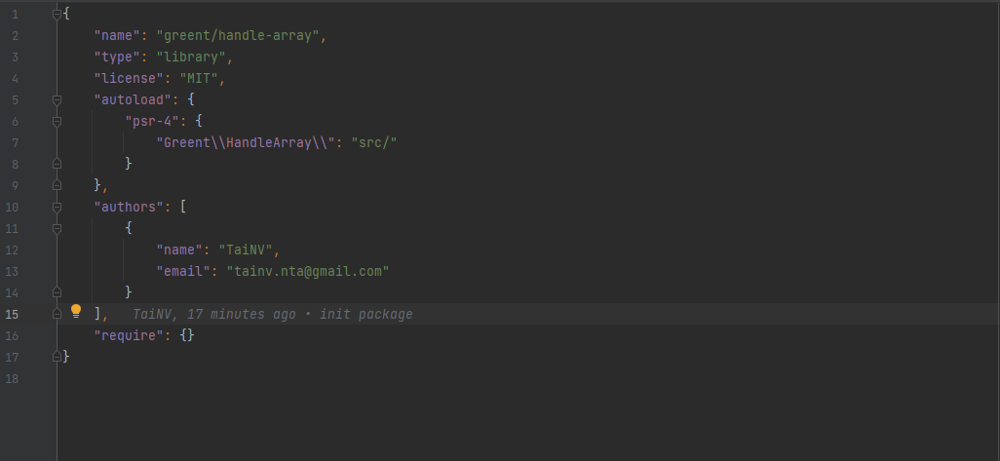
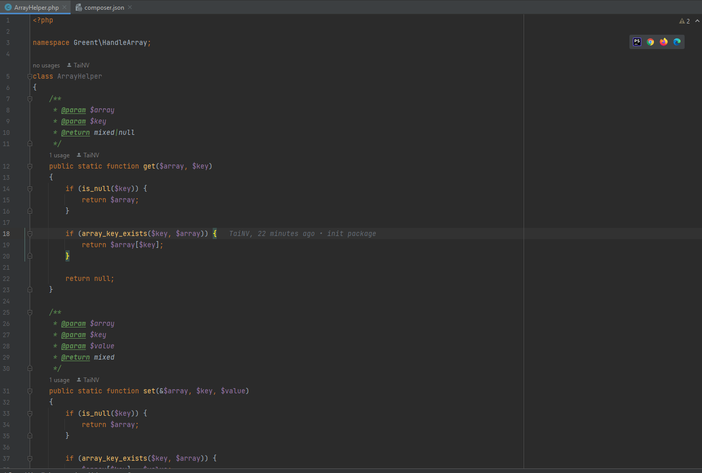
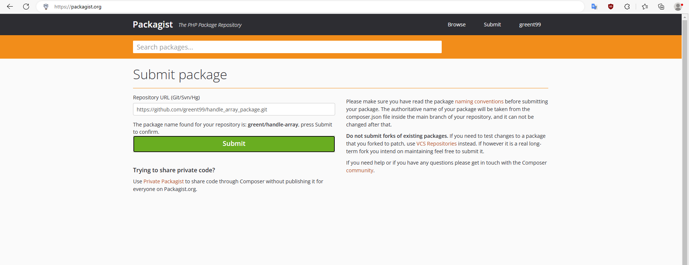
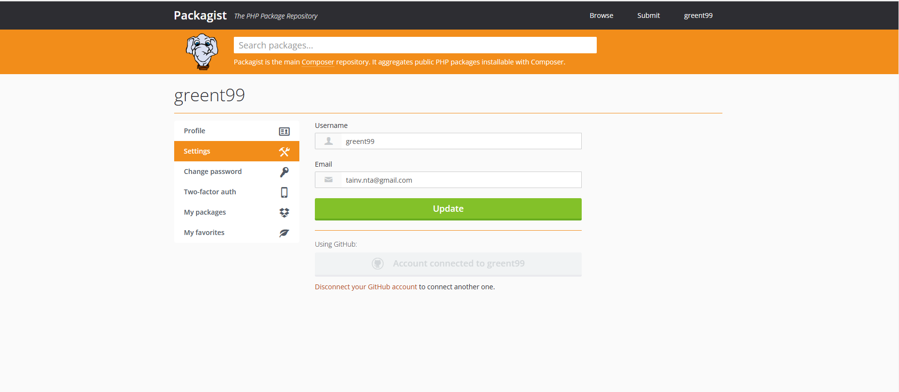

# Cách tạo 1 package và publish lên composer


## Các bước cần thực hiện

- [Tạo package](#create-package)
- [Publish package lên Git](#publish-package-to-github)
- [Publish package lên Packagist](#publish-package-to-packagist)
- [Demo](#demo)

## <a name="create-package">Tạo package</a>
1. Một package sẽ có cấu trúc thư mục như sau <br>
    <br>
2. Nội dung của package sẽ được đặt trong folder src <br>
3. Tạo file composer bằng command
```php
composer init
```
4. Điền các thông tin liên quan đến package: name, description, author v.v
5. Ví dụ file composer <br>
    <br><br>
   Từ Laravel version 5.5, Laravel đã hỗ trợ package auto discover. Vì vậy chúng ta có thể thêm vào file composer.json để nó tự động map vào provider
## <a name="publish-package-to-github">Publish package lên Git</a>
## <a name="publish-package-to-packagist">Publish package lên Packagist</a>
1. Tạo account trên Packagist (https://packagist.org/)
2. Submit package mình mong muốn
   
3. Liên kết account Git với Packagist để package auto update khi có thay đổi ở Git Repository
4. Đến đây người khác có thể install package của mình thông qua command sau
```php
composer require {package_name}
```
## <a name="demo">Demo</a>
1. Tạo folder chứa package với cấu trúc thư mục như sau
    <br>
2. Nội dung file composer.json 
   
3. Tạo file ArrayHelper trong folder src
   
4. Publish source lên Github
   
5. Submit package trên Packagist
    
6. Connect account Packagist với Github để auto-update
   
7. Bây giờ người khác có thể install nó và sử dụng
```php
composer require greent/handle-array
```
8. Example
```php
$array = ['name' => 'Tai', 'email' => 'tainv.nta@gmail.com'];
return \Greent\HandleArray\ArrayHelper::get($array, 'name');
```
```php
Tai
```


